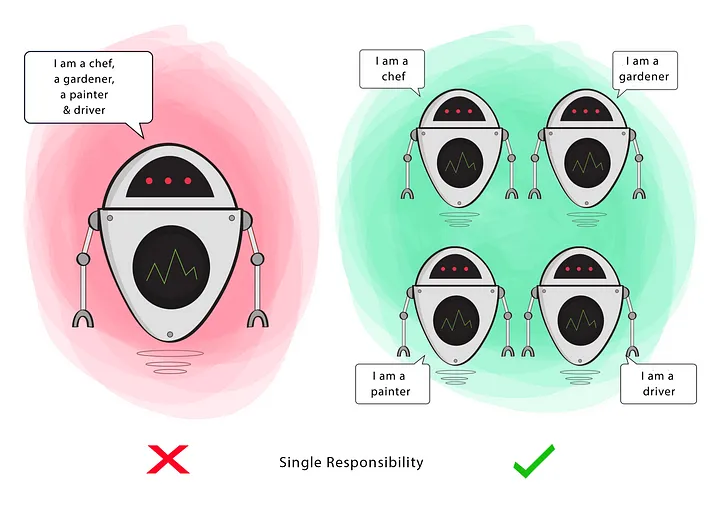

# Single Responsability

**A class should do one thing** and therefore it should have only a single reason to change.

This principle aims to **separate behaviours** so that if bugs arise as a result of your change, **it won’t affect other unrelated behaviours**.

